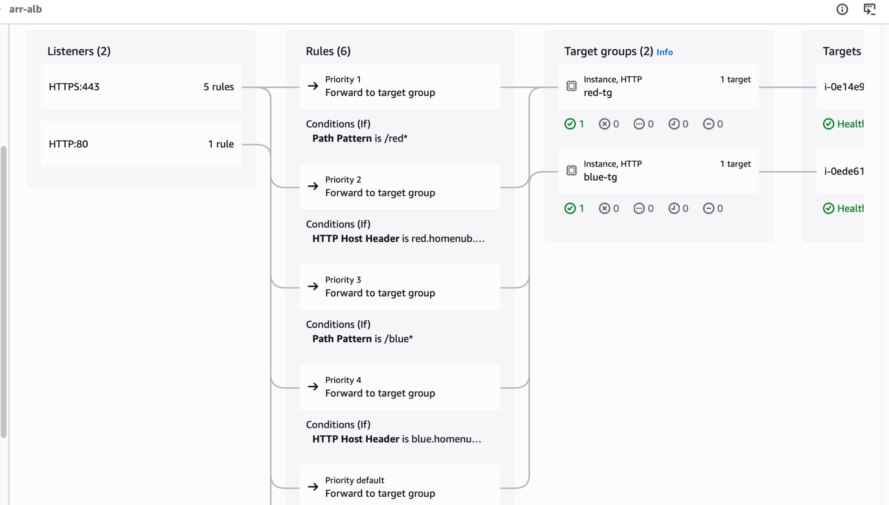
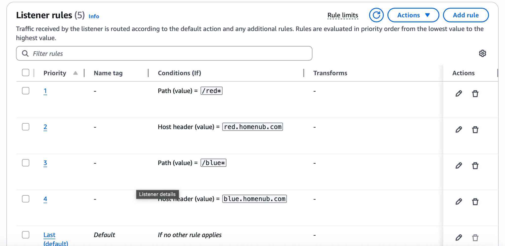

# Advanced Request Routing with ALB (Host & Path Based) + Auto Scaling

This project demonstrates a production style AWS architecture that implements advanced request routing using an Application Load Balancer (ALB). The environment is deployed using AWS CloudFormation Infrastructure as Code (IaC) and showcases how to design a scalable, highly available web architecture on AWS.

The solution uses host-based routing to support multiple domains behind a single load balancer. Incoming requests are evaluated using the HTTP host header, allowing the ALB to route traffic to different target groups and EC2 Auto Scaling Groups depending on the requested domain.

In addition to host routing, the architecture implements path-based routing (URL-based routing). ALB listener rules inspect the request path and forward traffic to the appropriate backend service based on defined routing patterns. This enables multiple applications or services to share a single load balancer entry point while maintaining clear traffic segmentation.

To demonstrate scalable infrastructure design, the project integrates EC2 Auto Scaling Groups with target tracking policies that scale compute resources dynamically based on the ALBRequestCountPerTarget metric. This ensures the environment can automatically adjust capacity in response to traffic demand.

The architecture also includes static website hosting on Amazon S3, which is integrated with other AWS services to deliver a secure, highly available web solution.

## Overview

Key AWS services used in this project include:
-   Virtual Private Cloud (VPC) for deploying resources in a private network environment
-   AWS Application Load Balancer (ALB) for intelligent traffic routing
-   Amazon EC2 Auto Scaling for dynamic horizontal scaling
-   Amazon Route 53 DNS integration for DNS management and domain routing
-   AWS Certificate Manager (ACM) for HTTPS/TLS certificate management
-   Amazon S3 for static website hosting and content storage
-   Multi-AZ networking architecture for high availability
-   AWS CloudFormation for automated infrastructure deployment

------------------------------------------------------------------------

## Auto Scaling Validation

Each Auto Scaling Group uses:

-   Metric: ALBRequestCountPerTarget
-   Target Value: 50 requests per target
-   Instance Warmup: 300 seconds
-   Min: 1
-   Max: 3

To trigger Auto Scaling events, a simple load test was performed against the Red endpoint. The command below generated repeated HTTPS requests to the Application Load Balancer, increasing the ALBRequestCountPerTarget metric used by the scaling policy.

</> Bash

for i in {1..1000}; do
  curl -sk -o /dev/null -w "%{http_code}\n" https://red.homenub.com/red/index.html
done

### Scaling Activity Evidence

This sustained request volume triggered CloudWatch alarms and caused the Auto Scaling Group to scale out automatically.

------------------------------------------------------------------------

## Host-Based Routing Validation

Traffic routed correctly based on host headers:

-   https://red.homenub.com → Red Target Group
-   https://blue.homenub.com → Blue Target Group

### Red Environment

### Blue Environment

------------------------------------------------------------------------

## Path-Based Routing Validation

Routing rules:

-   /red\* → Red Target Group
-   /blue\* → Blue Target Group

### Red Path

### Blue Path

# 

------------------------------------------------------------------------

## Target Groups & Load Balancer

Traffic is distributed across multiple Availability Zones with private
EC2 instances deployed behind the Application Load Balancer.

------------------------------------------------------------------------
## Architecture Highlights

This environment demonstrates:

-   Secure multi-AZ architecture
-   HTTPS termination using ACM
-   Route 53 DNS integration
-   Dynamic scaling based on real traffic metrics
-   Modular nested CloudFormation stacks

------------------------------------------------------------------------

## Technical Skills Demonstrated

- AWS Cloud Architecture: Designing a highly available, multi-AZ load balanced environment
- Application Load Balancer (ALB): Implementing host-based and path-based routing
- Auto Scaling: Configuring target tracking policies using ALBRequestCountPerTarget
- Infrastructure as Code: Deploying modular infrastructure using AWS CloudFormation nested stacks
- AWS Networking: VPC design, public/private subnets, and security group configuration
- DNS & TLS Management: Route 53 domain routing and HTTPS using AWS Certificate Manager (ACM)
- Scalability Testing: Generating load to validate Auto Scaling behavior and CloudWatch metrics
- DevOps Tooling: Using AWS CLI for infrastructure deployment, validation, and troubleshooting

------------------------------------------------------------------------

## Lessons Learned

1.  Target tracking requires sustained load, not burst traffic.
2.  Listener rule priority directly impacts routing behavior.
3.  Instance warmup settings help prevent scaling instability.
4.  Nested CloudFormation stacks improve re-usability and scalability but require careful parameter management
5.  Always validate CloudFormation templates before deployment.

------------------------------------------------------------------------

## Production Enhancements (Future Improvements)

-   Add AWS WAF for enhanced security
-   Enable ALB access logs for monitoring and analysis
-   Add CloudFront in front of ALB for edge caching and improved performance
-   Add a database tier (e.g Amazon RDS) to support dynamic application workloads
